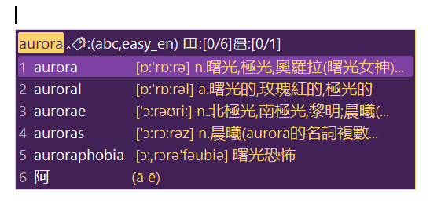
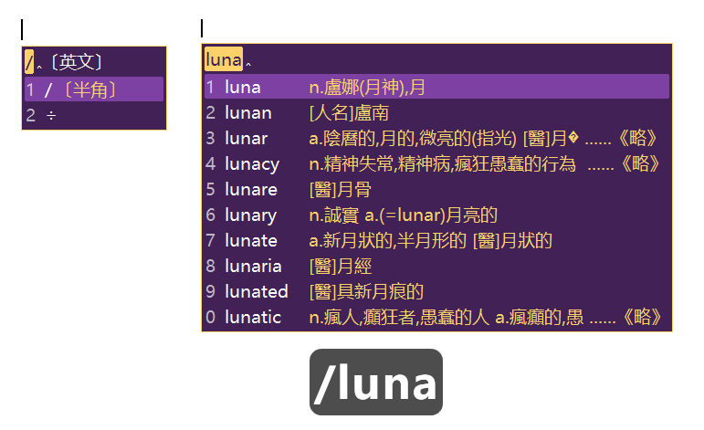
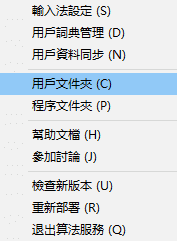
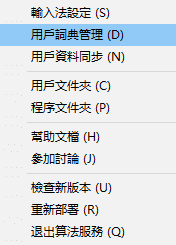
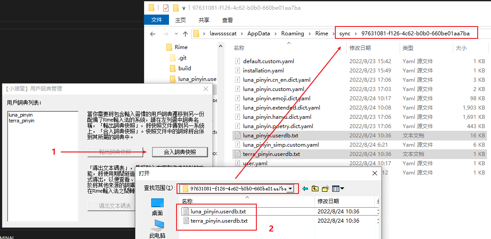

# 电脑 rime 极光方案（朙月拼音、地球拼音）

本项目作用于[rime 输入法](https://rime.im/)（Weasel），对原方案（朙月拼音、地球拼音）进行修改补充。

该方案沿用“用户目录”结构，有如下两种文件：

1. rime方案配置文件（如：`*.yaml`， `/opencc`， `/lua`， `/font`）
2. “用户资料同步”生成文件（如，`/sync`）

## 内容说明

基于“地球拼音”修改，添加配色、英文、符号&表情、一些lua脚本。

1. 配色 “凝光紫x申布伦黄”
    
    <!--  -->
    <!-- 0x562242 0x422256 --><br>
    <!-- 0x6AD2FB FBD26A --><br>
    <!-- 0xA3417D 7D41A3 --><br>

    调色板：<https://bennyyip.github.io/Rime-See-Me/>

2. 英文 

    直接输入英文，会提示含义

    

    “`/`”  前缀：开启纯英文模式

    

3. “`//`” 前缀：符号 & 表情 & 颜表情

    todo 

4. 输入 “rq”、“sj”、“xq” 等可显示当前系统时间

    

5. 网站提示

    todo 

## 方案说明

编写了两个方案：（个人）地球拼音、（个人）朙月拼音

1. （个人）地球拼音

    + 配置入口：`my_terra_pinyin.schema.yaml`
    +  以 `terra_pinyin` 作为基础码表
    + 显示音调（e.g. 朙月 ming2 yue4 => míng yuè）
    
    + `shift + <num 7~0>` 转换音调

2. （个人）朙月拼音

    + 配置入口： `my_luna_pinyin.schema.yaml`
    + 以 `luna_pinyin` 作为基础码表
    + 忽略音调

## 字体说明

默认使用系统字体，可能出现字大小不一的的情况。

可以根据 `font` 目录的 [文档](./font/README.md) 设置字体。

## 按键说明

### 全局（always）

1. `F4` 选择方案和其选项开关

    todo 图片

### 待输入（composing）

1. `` ` `` 开启五笔反查模式

    todo 图片

1. `/` 开启纯英文模式 - [#内容说明](#内容说明)

1. `//` 开启符号模式 - [#内容说明](#内容说明)

### 结果页（has_menu/paging/editor）

1. `<` 和 `>` 为左右翻页（同 `-` 和 `=`）

    todo 图片

2. （仅地球拼音支持）通过编码结尾输入 `shift + <num 7~0>` 设置四声（ā á ă à）

    todo 图片

1. `shift+⬆️（上）` 上一页、`shift+⬇️（下）` 下一页

1. 选中结果，`shift+↩️（回车）` 输出comment结果

## 安装方法

### 步骤一：拷贝文件📄到“用户文件夹📁”

</img>

把项目文件全部复制到“用户文件夹📁”（右图，右键点击小图标可见），然后点击“重新部署”即可。

> **注意⚠️**<br>
> 如果有“用户词典快照🎦”需要同步，请先看“步骤二”

```yml
# 不同系统中，“用户文件夹📁”的一般路径
%APPDATA%\Rime  ( Windows 小狼毫 )
~/Library/Rime  ( Mac OS 鼠鬚管 )
~/.config/ibus/rime  ( Linux 中州韻 )
~/.config/fcitx/rime  ( Linux )
```

<div style='clear: both;'></div>

### 步骤二：**同步“用户词典快照🎦”**：（如有要）

</img>

> “用户词典快照🎦”包含了用户常用的词。重新安装时，可以通过导入快照，迅速的还原熟悉的打字环境

1. 选择“用户词典管理”（右图，右键点击小图标可见）打开“快照管理界面”。
2. 导出<br>
    左边选择要导出“用户词典快照🎦”的快照名，点击右边的“输出词典快照”。
    > “用户词典快照🎦”一般会被导出到`./sync`目录
3. 导入<br>
    点击右边的“合入词典快照”，选择需要的“用户词典快照🎦”进行导入。

<div style='clear: both;'></div>



## 其他

### opencc 词汇去重

```bash
npm install
npm run sort
```

### 相关资料

> 使用指引
>
> + 官方指引 - <https://github.com/rime/home/wiki/UserGuide>
> + 我的笔记 - <http://t.csdn.cn/grD5H>
> <!-- https://blog.csdn.net/LawssssCat/article/details/103482619 -->

> 配置信息
> 
> + 《Schema.yaml 詳解》:+1: -  <https://github.com/LEOYoon-Tsaw/Rime_collections/blob/master/Rime_description.md>
> + 《yaml 追加规则》:+1: - <https://github.com/rime/home/wiki/Configuration>

> 参考方案
>
> + 洋葱方案 - <https://github.com/oniondelta/Onion_Rime_Files><br>
>（注音、雙拼、拼音、形碼、行列30）
> + 流星追月 - <https://github.com/zhuangzhemin/rime><br>
> （小鹤双拼为主）
> + 星空键道6 - <https://github.com/xkinput/Rime_JD><br>
>（中文输入法方案）
> + iDvel - <https://github.com/iDvel/rime-ice><br>
>（全拼方案、简体）

> 码表
>
> + 酥梨小鹤 - <https://github.com/zodensu/FlyPY-zodensu>

> lua脚本
>
> + hchunhui/librime-lua - <https://github.com/hchunhui/librime-lua><br>
> （运行lua脚本插件）
> + shewer/librime-lua-script - <https://github.com/shewer/librime-lua-script><br>
>（利用 librime-lua 擴展 rime 輸入法的集成模組）

> 已知问题：
>
> - [ ] 2022年09月07日<br>
> 输入无限制/大量无规则输入导致卡顿<br>
> <https://github.com/rime/librime/issues/510><br>
> <https://github.com/rime/weasel/issues/733>
> - [ ] 2022年09月07日<br>
> comment数量过多导致闪退<br>
> <https://github.com/rime/home/issues/1129>