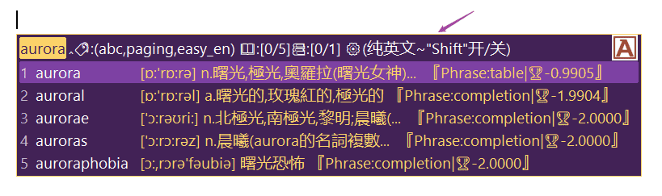
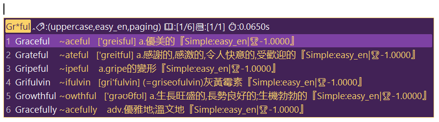
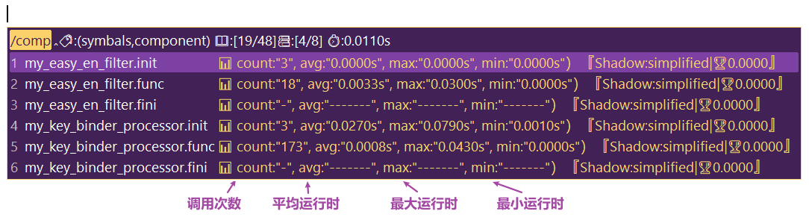
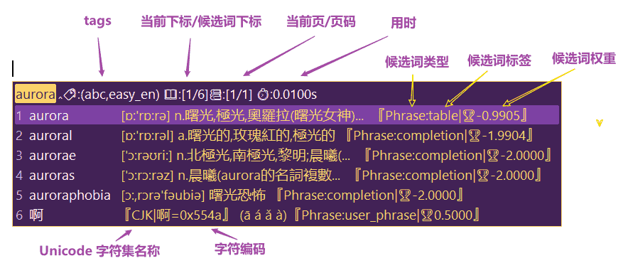
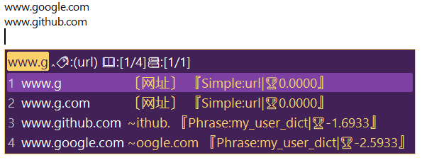
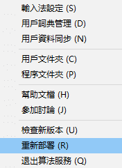

# 电脑 rime 极光方案（朙月拼音）

本项目作用于[rime 输入法](https://rime.im/)（Weasel），对原方案（朙月拼音）进行修改补充。

配置入口： `my_luna_pinyin.schema.yaml`

该方案沿用“用户目录”结构，有如下两种文件：

1. rime方案配置文件（如：`*.yaml`， `/opencc`， `/lua`）
2. “用户资料同步”生成文件（如，`/sync`）

```
/
├─ /sync                备份：（个人）词典快照
├─ /*.userdb            备份：用户字典（动态字典：随用户输入动态更新）
│
├─ /build               ⭐️最终配置：通过“重新部署”整合所有文件到此目录
│                         （包括：用户目录、程序目录）
│
├─ /patch               ⚙补丁文件夹（存放主要的扩展功能配置）
│  ├─ ext_*.yaml           🍮补丁：方案会通过`__include`引用其中配置
│  └─ my_*.yaml            🍮补丁：方案会通过`__patch`引用其中配置
├─ /opencc              ⚙提供字符转换、comment功能
│  ├─ *.txt                字典文件，由`bash run.sh sort`生成，被*.json引用
│  ├─ *.yml                字典源
│  └─ *.json               字典配置
├─ /lua                 ⚙提供功能脚本（运行中、lua）
│  └─ *.lua                功能脚本，被rime.lua引用
│
├─ /dict/*.dict.yaml    📄码表
│
├─ /lua/build/*         🛠构建共用脚本
├─ /tools/*             🛠构建共用脚本
├─ install.sh           🛠安装脚本
├─ run.sh               🛠构建脚本
│
├─ *.schema.yaml        💠方案配置文件（✨核心、入口） 
├─ *.custom.yaml        🍮补丁：内容会覆盖对应的*.schema.yaml文件
├─ *.gram               语法模型，在schema中用grammar引用
├─ rime.lua             入口文件，定义schema引用的lua脚本对应关系
├─ default.custom.yaml  设置输入法菜单（menu）
├─ weasel.custom.yaml   设置输入法外观（style）
├─ user.yaml            记录当前输入法运行信息（如：部署编号、用户选择）（在每次部署后自动生成）
├─ installation.yaml    记录当前输入法安装信息（如：版本、安装时间）
├─ custom_phrase.txt    
├─ .gitignore
├─ README.md
└─ LICENSE              MIT
```

## 内容说明

基于“朙月拼音”修改，添加配色、英文、符号&表情、一些lua脚本。

1. 配色 “凝光紫x申布伦黄”
    
    <!--  -->
    <!-- 0x562242 0x422256 --><br>
    <!-- 0x6AD2FB FBD26A --><br>
    <!-- 0xA3417D 7D41A3 --><br>

    调色板：<https://bennyyip.github.io/Rime-See-Me/>

2. 英文 

    直接输入英文，会提示含义

    

    按 “`shift`” 切换 “纯英文模式”

    

    输入 “`*`” 进行 “模糊匹配”

    

3. 子列表展示：emoji 表情 & 颜表情

    

1. 上屏记忆

    提交上屏的词汇，再次输入会显示在较前的位置

4. 动态候选词

    - [x] 输入 "/rq"、"/sj"、"/xq" 可显示当前系统时间
    - [x] 输入 "/history" 可显示输入历史
    - [x] 输入 "/version" 可显示版本信息
    - [x] 输入 "/component" 可显示 lua component 运行状态（调试用）<br>
        
    - [x] 输入 "/=[0-9+-*/^%()]" 可计算数学表达式，如：“`/=1+1`” => 2
    - [ ] 输入 "/ascii" 可打印 ascii 表
    - [ ] 输入 "/table" 可打印不同格式的表格框架

1. LaTeX

    todo https://github.com/shenlebantongying/rime_latex

5. CJK字符集提示（开启关闭：F4选择/快捷键 `Ctrl+7`）

1. 候选词详情提示（开启关闭：F4选择/快捷键 `Ctrl+8`）

    

    

1.  网站提示

    

6. 词联想

    todo

    https://github.com/shewer/librime-lua-script

    https://github.com/rime/librime/issues/65

    https://github.com/rime/librime/issues/568

## 按键说明

1. 全局 - `F4` - 选择方案和其选项开关
1. 全局 - `` ` `` -  开启五笔反查模式（横竖撇捺折 => 一丨丿丶乙 => hspnz）
1. 选词 - `shift` - 开启纯英文模式 💡
1. 选词 - `shift+↩️（回车）` 上屏右侧提示信息 💡
1. 选词 - `shift+⬆️（上）` 或 `shift+⬇️（下）` - 翻页 💡
1. 选词 - `shift + 🆑（Delete：小键盘删除键）` - 删除选词的用户字典记录 💡

## 安装方法（脚本安装）

1. 关闭输入法 “退出算法服务”

2. 执行脚本（需要：安装了git、配置了bash、指定输入法的“安装目录”、“用户目录”）

    ```bash
    # 指定输入法的“安装目录”（自行更改）
    path_installation="E:\Program Files (x86)\Rime\weasel-0.14.3"
    # 指定输入法的“用户目录”（自行更改）
    path_userdata="C:\Users\lawsssscat\AppData\Roaming\Rime"
    bash install.sh $path_installation $path_userdata
    ```

3. 开启输入法 & “重新部属” 

## 安装方法（手动安装）

### 步骤一：拷贝文件到“用户文件夹📁”

</img>

把项目文件全部复制到“用户文件夹📁”（右图，左键点击小图标可见）

```yml
# 不同系统中，“用户文件夹📁”的一般路径
%APPDATA%\Rime  ( Windows 小狼毫 )
~/Library/Rime  ( Mac OS 鼠鬚管 )
~/.config/ibus/rime  ( Linux 中州韻 )
~/.config/fcitx/rime  ( Linux )
```

<div style='clear: both;'></div>

### 步骤二：**更新 librime-lua** 📄

准备 rime.dll （从本项目的 [release](https://github.com/LawssssCat/rime-aurora/releases/latest) 中下载备份，或者到 librime-lua 项目下载[最新版本](https://github.com/hchunhui/librime-lua/actions)），然后将 rime.dll 文件覆盖到 weasel 安装目录下，即可。

（如果提示 rime.dll 正在使用，先关闭输入法 “退出算法服务”）

> ⚠️ 说明
>
>[librime-lua 插件](https://github.com/hchunhui/librime-lua)提供了输入法程序运行时执行 lua 脚本功能。
>
>librime-lua 插件 [已经被 librime 添加进项目编译](https://github.com/rime/librime/blob/master/.github/workflows/release-ci.yml#L21)，但所包含的 [librime-lua 插件版本会偏旧](https://github.com/hchunhui/librime-lua/issues/43)。
>
> 🌟 **因此体验本方案完整功能需要 [更新 librime-lua 插件](https://github.com/hchunhui/librime-lua/issues/43#issuecomment-1242881504)。**

> 💡 相关资料
> 
> + issue 内置 <https://github.com/hchunhui/librime-lua/issues/41>
> + wiki api <https://github.com/hchunhui/librime-lua/wiki#installation>
> + issue 调试 <https://github.com/hchunhui/librime-lua/issues/43#issuecomment-1242955543>

### 步骤三：**重新部署** ⚙

</img>

点击 “重新部署” ⚙ 即可。（右图，左键点击小图标可见）

> ⚠️ 注意
>
> 『第一次』部署大概需要等待几分钟。

<div style='clear: both;'></div>

## 字体说明

默认使用系统字体，可能出现字大小不一的的情况。

1. 解压、安装
1. 修改 weasel.custom.yaml 文件
    ```yaml
    patch:
        style/font_face: "Segoe UI" #字體〔小狼毫得且僅得設一個字體；鼠鬚管得設多個字體，後面的字體自動補前面字體不含的字〕
    ```

更多字体下载地址：

1. <https://www.googlefonts.cn/>
1. <https://www.cufonfonts.com/>
1. ~~<https://code.google.com/archive/p/ifont/downloads>~~

## 其他

### opencc 词汇去重

```bash
bash run.sh sort
```

### 单元测试

```bash
bash run.sh test
```

### 查看日志

<https://github.com/hchunhui/librime-lua/issues/129>

```bash
bash run.sh log
# 或者
bash tools/tailLog.sh
```

### 同步“用户词典快照🎦”

</img>

> “用户词典快照🎦”包含了用户常用的词。重新安装时，可以通过导入快照，迅速的还原熟悉的打字环境

1. 选择“用户词典管理”（右图，右键点击小图标可见）打开“快照管理界面”。
2. 导出<br>
    左边选择要导出“用户词典快照🎦”的快照名，点击右边的“输出词典快照”。
    > “用户词典快照🎦”一般会被导出到`./sync`目录
3. 导入<br>
    点击右边的“合入词典快照”，选择需要的“用户词典快照🎦”进行导入。

<div style='clear: both;'></div>


### 相关资料

> 使用指引
>
> + 官方指引 - <https://github.com/rime/home/wiki/UserGuide>
> + ~~我的笔记 - <https://blog.csdn.net/LawssssCat/article/details/103482619>~~

> 配置信息
> 
> + 《Schema.yaml 詳解》:+1: -  <https://github.com/LEOYoon-Tsaw/Rime_collections/blob/master/Rime_description.md>
> + 《yaml 追加规则》:+1: - <https://github.com/rime/home/wiki/Configuration>

> 参考方案（[x] 为已整合方案）
>
> + [x] 洋葱方案 - <https://github.com/oniondelta/Onion_Rime_Files><br>
>（注音、雙拼、拼音、形碼、行列30）<br>
> + [x] 行列30 - <https://github.com/rime/rime-array>
> + [ ] 融合拼音(rime_melt) - <https://github.com/tumuyan/rime-melt>
> + [x] 可混输的英文输入法 - <https://github.com/BlindingDark/rime-easy-en>
> + [ ] 流星追月 - <https://github.com/zhuangzhemin/rime><br>
> （小鹤双拼为主）
> + [ ] 星空键道6 - <https://github.com/xkinput/Rime_JD><br>
>（中文输入法方案）
> + [ ] iDvel - <https://github.com/iDvel/rime-ice><br>
>（全拼方案、简体）
> + [ ] <https://github.com/DreamAfar/Rime-IME-for-iOS-iRime><br>
> （ios）
> + [ ] <https://github.com/xinlc/dotfiles/tree/master/mac/Rime><br>
> （ios）
> + [ ] <https://github.com/srackhall/My-rime-Personal-configuration/tree/main>
> + [ ] <https://github.com/riverscn/rime-forge/>

> 码表
>
> + 酥梨小鹤 - <https://github.com/zodensu/FlyPY-zodensu>

> 语言模型
>
> + 八股文（語法） - <https://github.com/lotem/rime-octagram-data/tree/hans>

> lua脚本
>
> + hchunhui/librime-lua - <https://github.com/hchunhui/librime-lua><br>
> （运行lua脚本插件）
> + ~~shewer/librime-lua-tools - <https://github.com/shewer/librime-lua-tools>~~<br>
> （工具脚本，己轉移至 (https://github.com/shewer/librime-lua-script) tools/）
> + shewer/librime-lua-script - <https://github.com/shewer/librime-lua-script><br>
>（利用 librime-lua 擴展 rime 輸入法的集成模組）
> + shewer/rime-english - <https://github.com/shewer/rime-english><br>
> （Rime English輸入方案）

> 词源
> + <https://github.com/skywind3000/ECDICT><br>
> 英文
> + <https://ssnhd.com/2022/01/06/sogou-dict/><br>
> 搜狗词库转换方法（支持多家输入法）
> + <https://github.com/studyzy/imewlconverter><br>
> 深蓝词库转换

> 插件
> + 〖lua脚本〗执行插件 - <https://github.com/hchunhui/librime-lua>
> + 优化分句体验 - <https://github.com/TsinamLeung/librime-sentencer>
> + 〖八股文〗語法插件 - <https://github.com/lotem/librime-octagram>
> + ~~<https://github.com/hchunhui/librime-cloud>~~

> 已知问题：
>
> - [ ] 2022年09月07日<br>
> 输入无限制/大量无规则输入导致卡顿<br>
> <https://github.com/rime/librime/issues/510><br>
> <https://github.com/rime/weasel/issues/733><br>
> <https://github.com/rime/librime/issues/544><br>
>  2022年09月09日<br>
>  添加加输入限制lua脚本
> - [ ] 2022年09月07日<br>
> comment数量过多导致闪退<br>
> <https://github.com/rime/home/issues/1129>
> - [ ] 2022年09月20日<br>
> weasel不显示彩色emoji<br>
> （需要微软独家的DirectWrite字体渲染引擎才能支持彩色emoji）
> - [ ] 2022年09月30日<br>
> prompt 随 caret 移动问题<br>
> <https://github.com/rime/weasel/issues/775>
> - [x] 2022年09月30日<br>
> emoji 太多类似的，影响正常候选词。<br>
>  2022年10月04日<br>
>  增加子菜单功能。（emoji显示再子菜单）

> 待优化问题：
>
> - [x] 英文大写不提示小写信息
> - [x] 网址提示 <br>
> => 用户字典记录输入的网址，再次输入提示
> - [ ] 提示未完整 symbols 候选词、并显示各分类含义
> - [x] 去重不完整：uniquifier应尽量放后
> - [x] 记词
> - [x] 删词
